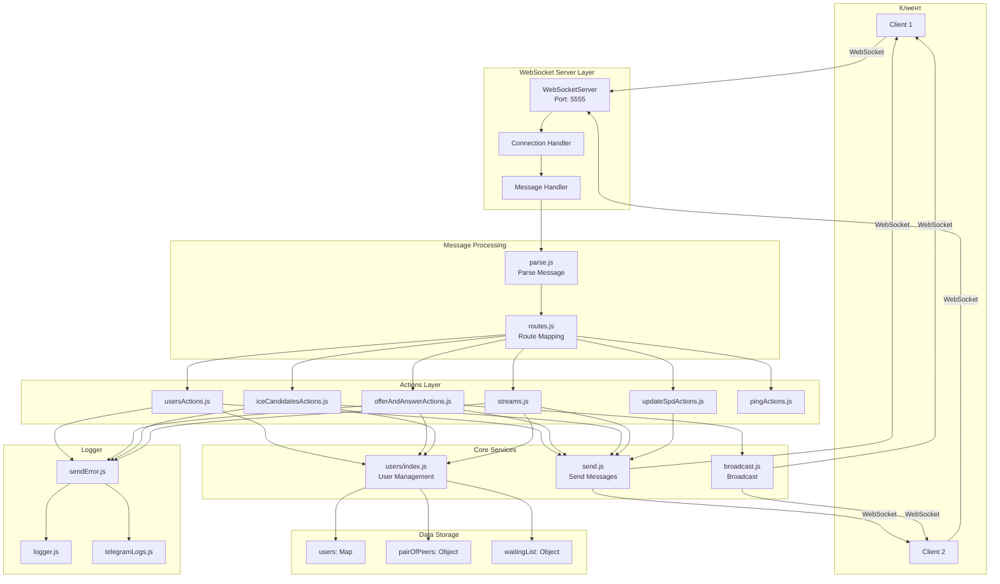
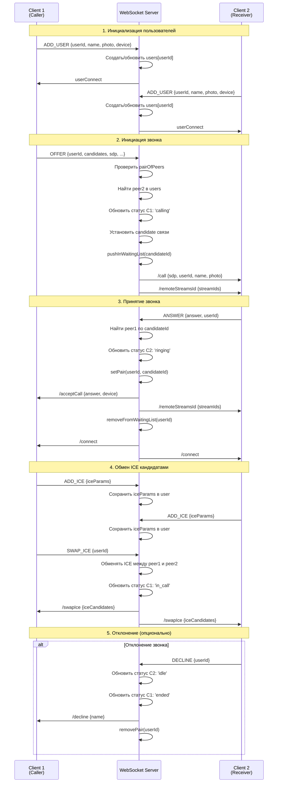
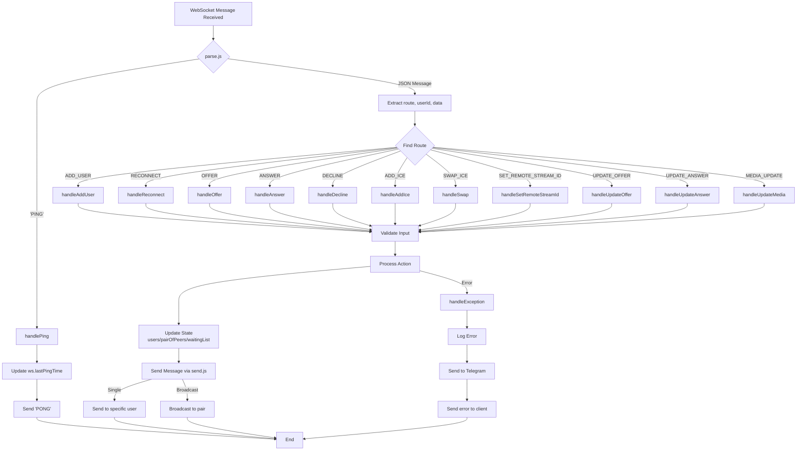
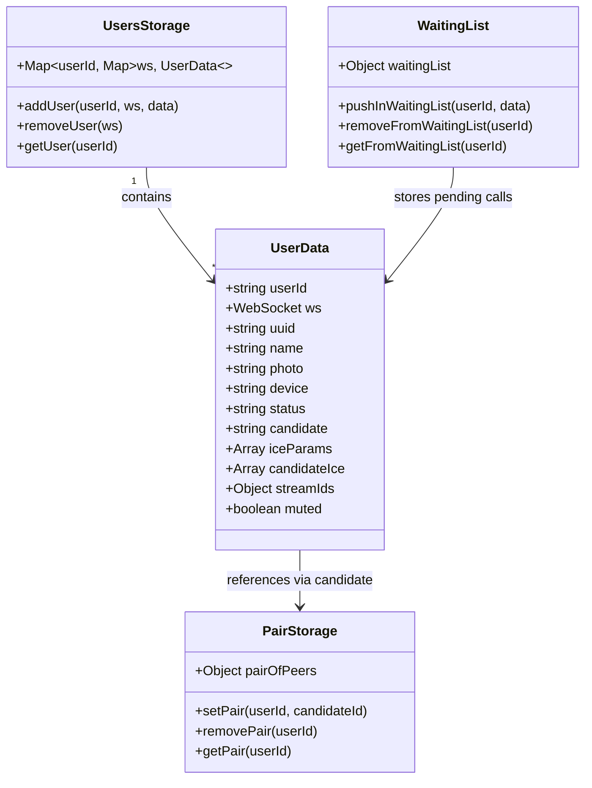
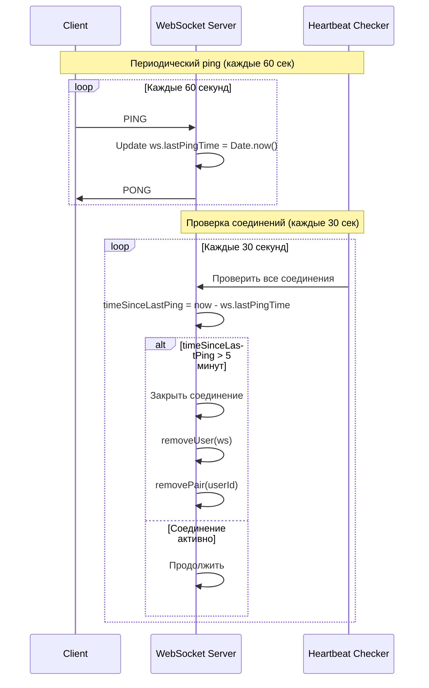

# Архитектура P2P Backend

## Общая архитектура системы



## Поток установки звонка (Call Flow)



## Поток обработки сообщений



## Структура данных



## Heartbeat механизм



## Процесс реконнекта

```mermaid
flowchart TD
    START[Connection Lost<br/>WebSocket Close/Error]
    START --> CLIENT_DETECT[Client Detects Disconnection]
    
    CLIENT_DETECT --> SAVE_STATE[Save Local State<br/>userId, candidateId, status]
    SAVE_STATE --> RECONNECT_ATTEMPT[Attempt Reconnect<br/>with exponential backoff]
    
    RECONNECT_ATTEMPT -->|Success| NEW_WS[New WebSocket Connection]
    NEW_WS --> SEND_RECONNECT[Send RECONNECT<br/>{userId, name, photo, device}]
    
    SEND_RECONNECT --> SERVER_CHECK[Server: Check existing session]
    SERVER_CHECK -->|Session exists| FIND_ACTIVE[Find active session data]
    SERVER_CHECK -->|No session| ERROR_STATE[Return reconnectError]
    
    FIND_ACTIVE --> CLEAN_DEAD[Clean dead WebSocket connections]
    CLEAN_DEAD --> RESTORE_STATE[Restore session state<br/>status, candidate, streamIds]
    RESTORE_STATE --> ATTACH_WS[Attach new WebSocket]
    ATTACH_WS --> SEND_SUCCESS[Send reconnectSuccess<br/>{status, candidate}]
    
    SEND_SUCCESS --> CHECK_CANDIDATE{Has candidate?}
    CHECK_CANDIDATE -->|Yes| NOTIFY_PEER[Send /peerReconnected<br/>to candidate]
    CHECK_CANDIDATE -->|No| END[Reconnect Complete]
    NOTIFY_PEER --> END
    
    ERROR_STATE --> END
    
    END -->|If was in call| WEBRTC_RECON[Reconnect WebRTC<br/>via UPDATE_OFFER/ANSWER]
```

## Основные компоненты и их функции

### WebSocket Layer (`socket/`)
- **index.js**: Инициализация WebSocket сервера, обработка connection/message/close событий
- **parse.js**: Парсинг входящих сообщений (PING или JSON)
- **send.js**: Отправка сообщений клиентам (sendMessage, sendCancelMessage)
- **broadcast.js**: Рассылка сообщений паре пользователей

### Actions (`actions/`)
- **usersActions.js**: Добавление пользователей, реконнект
- **offerAndAnswerActions.js**: Обработка WebRTC offer/answer, отклонение звонков
- **iceCandidatesActions.js**: Сбор и обмен ICE кандидатами
- **streams.js**: Управление медиа-стримами (audio/video track IDs)
- **updateSpdActions.js**: Обновление SDP для реконнекта
- **pingActions.js**: Heartbeat механизм (ping/pong)

### Core Services (`users/`)
- **index.js**: Управление пользователями, парами, waiting list

### Logger (`logger/`)
- **logger.js**: Логирование ошибок
- **sendError.js**: Централизованная обработка исключений
- **telegramLogs.js**: Отправка уведомлений в Telegram

## Статусы пользователя

```
idle      → Пользователь не в звонке
calling   → Исходящий вызов (ожидает ответа)
ringing   → Входящий вызов (ожидает ответа)
in_call   → Пользователь в активном звонке
ended     → Звонок завершился, но еще не сброшено состояние
```

## Ключевые потоки данных

1. **User Management Flow**: ADD_USER → users Map → Waiting List Check
2. **Call Flow**: OFFER → Waiting List → ANSWER → setPair → SWAP_ICE → in_call
3. **Heartbeat Flow**: PING → Update timestamp → Heartbeat Check → Close if timeout
4. **Reconnect Flow**: RECONNECT → Restore state → Notify peer → WebRTC renegotiation
5. **Error Flow**: Exception → handleException → Log → Telegram → Client notification

